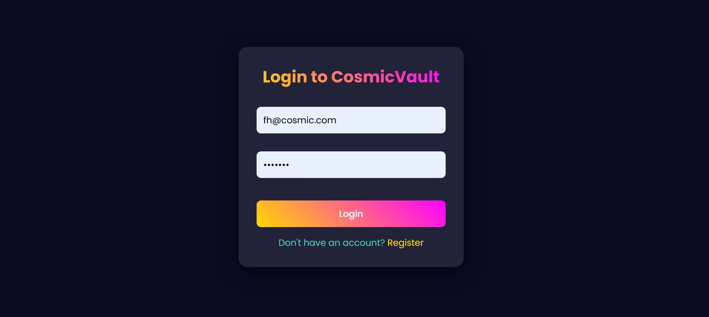
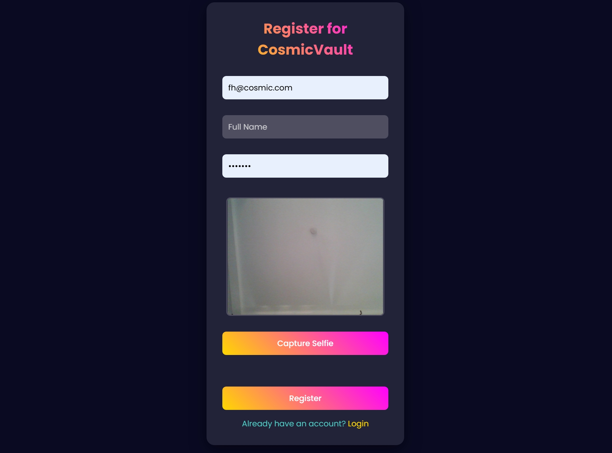
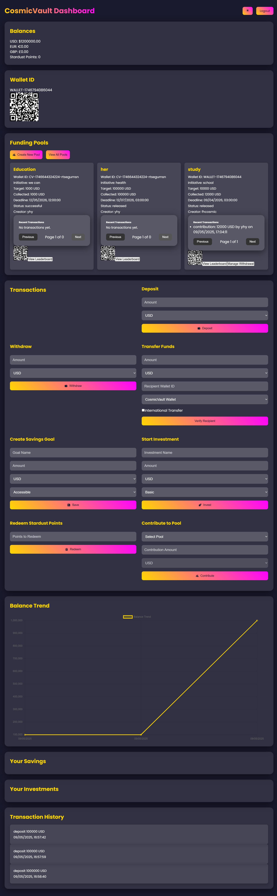
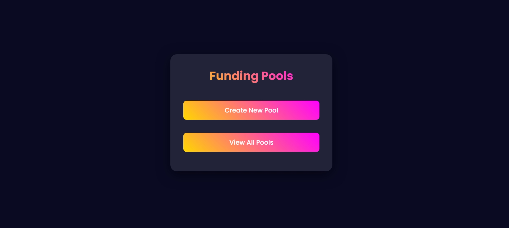
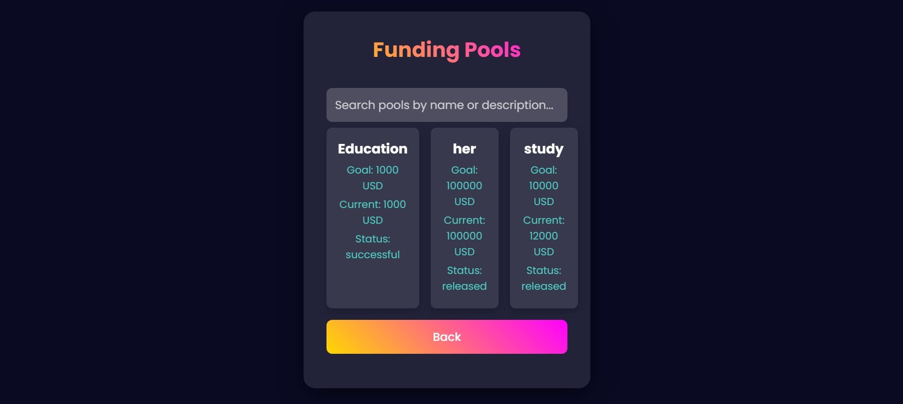

# CosmicVault 🚀

**CosmicVault** is a decentralized funding platform that blends a futuristic, sci-fi-inspired UI with powerful financial tools. Built with React, Node.js, and MongoDB, it enables users to create and contribute to funding pools, manage multi-currency wallets, redeem Stardust Points, and access an admin panel for withdrawal management—all wrapped in a cosmic, starry aesthetic. Whether you're crowdfunding a project or managing personal finances, CosmicVault takes you to the stars! 🌟

## ✨ Features

- **Funding Pools**: Create, view, and contribute to decentralized funding pools with real-time updates via Socket.IO.
- **Multi-Currency Support**: Manage wallets in USD, EUR, GBP, and track balances seamlessly.
- **Stardust Points**: Earn and redeem points for rewards within the platform.
- **Secure Authentication**: Register and log in with email, password, and KYC verification using JWT and bcrypt.
- **Admin Panel**: Manage withdrawals and oversee platform activity (admin-only).
- **Real-Time Notifications**: Instant updates on pool contributions, balance changes, and more.
- **Cosmic UI**: A neon-glow, glassmorphism design with gradient animations and a starry backdrop.
- **Multi-Platform Transfers**: Send funds to other CosmicVault wallets, mobile money, banks, Exness, or Binance—locally or internationally.
- **Savings & Investments**: Create accessible or fixed savings plans and invest in Basic, Gold, or Platinum options.

## 🖼️ Screenshots

### Login/Authentication

*Login page with cosmic starry background and secure authentication form.*

### Registration with KYC

*Registration form with KYC verification for secure onboarding.*

### Dashboard

*Main dashboard showcasing balances, funding pools, and transaction history.*

### Creating and Viewing Funding Pools

*Interface for creating and viewing funding pools with real-time updates.*

### View and Search Funding Pools

*Search and browse funding pools with filtering options.*

## 🛠️ Tech Stack

- **Frontend**: React, Tailwind CSS, Framer Motion, Axios, Chart.js, QRCode.react
- **Backend**: Node.js, Express, MongoDB, Socket.IO
- **Authentication**: JWT, bcrypt
- **Styling**: Custom cosmic theme with gradients, glassmorphism, and starry animations
- **Deployment**: GitHub Pages (frontend), Heroku/Render (backend, optional)

## 🚀 Getting Started

### Prerequisites
- Node.js (v16 or higher)
- MongoDB (local or MongoDB Atlas)
- Git
- A GitHub account for deployment

### Installation

1. **Clone the Repository**
   ```bash
   git clone https://github.com/Jahmax1/CosmicVault-Clean.git
   cd CosmicVault-Clean